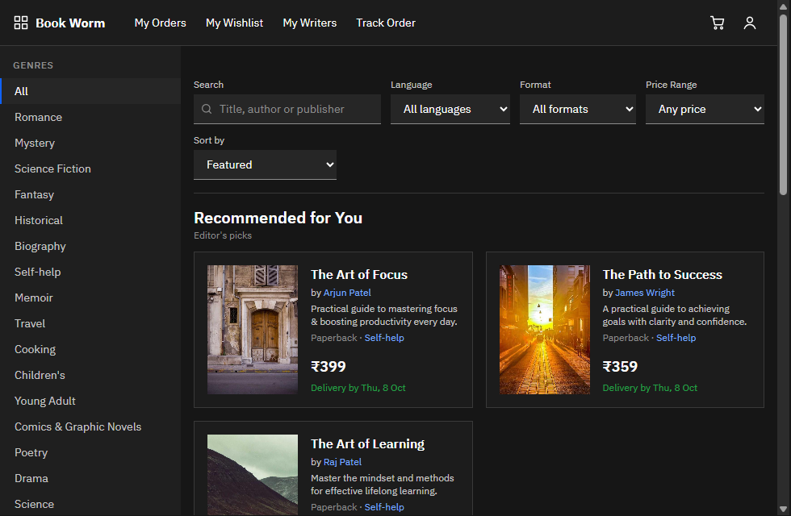
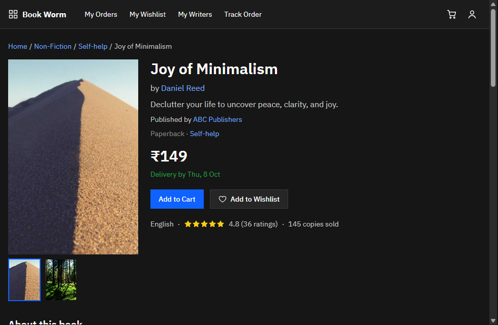
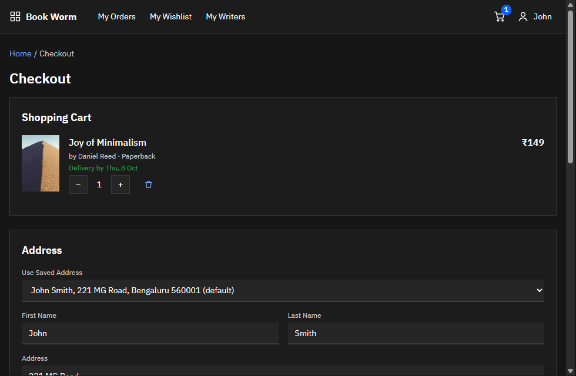
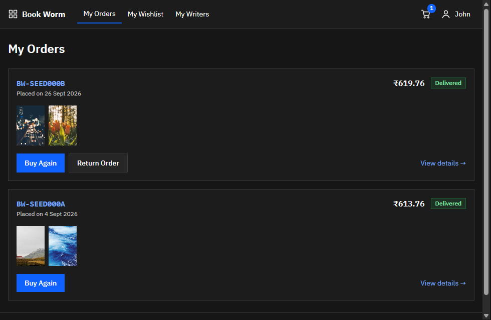
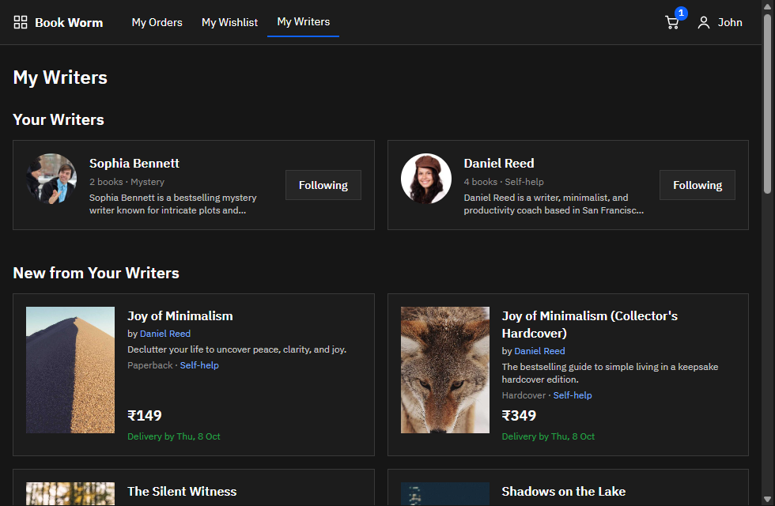
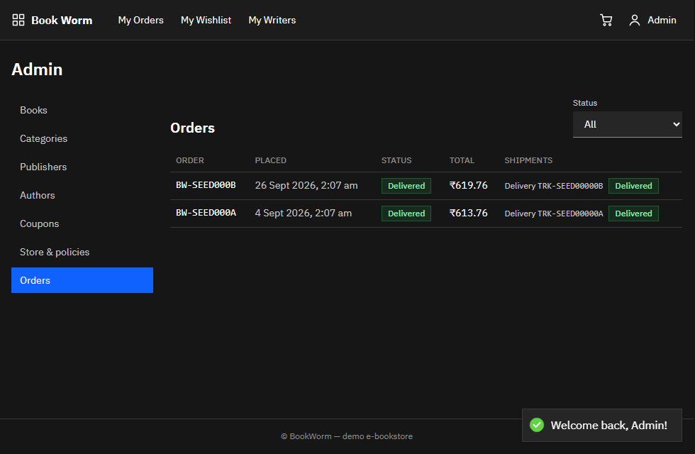

# BookWorm — demo e-bookstore

A dark-themed online bookstore where visitors browse and search the catalogue, buy as a guest or a registered customer, track orders, follow their favourite writers and manage everything from an admin area. It is built as a Node.js monorepo with a spec-first REST API and a React single-page app.

| Home | Book detail | Checkout |
|---|---|---|
|  |  |  |
| **My Orders** | **My Writers** | **Admin — orders & shipment simulator** |
|  |  |  |

## Features

- **Catalogue** — two-level genres, publishers, search, language/format/price filters, sorting; Recommended for You (personalised), Bestsellers, New Launches; all filters live in the URL.
- **Book detail** — front/back covers, reviews (1–5 ★, 100 chars), related reads, cross-sell and up-sell shelves, wishlist and follow-author buttons.
- **Cart + checkout on one page** — anonymous cart merged on sign-in, saved or typed address, coupons, gift points, 30-minute stock reservation.
- **Mock payments** — credit/debit card, UPI, wallet; failure + retry; only the last 4 card digits are ever stored.
- **Orders** — history, Buy Again, cancel within 48 h with refund, return within 7 days with a return shipment, change address before shipping, shipment timeline.
- **Guests** — buy with just an e-mail, track the order publicly, convert to a full account afterwards.
- **My Writers** — followed authors, their new books and suggested writers (authors are auto-followed on purchase).
- **Admin** — books (categories, primary genre, up-sell/cross-sell), categories, publishers, authors, coupons, store and policies, all orders with an "Advance shipment" simulator.

## Tech stack

Node.js 20 · Express 5 · Prisma 6 · PostgreSQL 16 · OpenAPI 3 + express-openapi-validator · JWT · React 18 · Vite 6 · Tailwind 3 · React Router 6 · Zustand 5 · Axios · Vitest 3 · Supertest · Testing Library · MSW 2 · Docker Compose + nginx.

```
packages/
  shared/   pricing (computeOrderTotals), INR formatting, dates, ids — used by api and web
  api/      Express API, Prisma schema/migrations/seed, openapi.yaml, tests
  web/      React SPA, tests, Dockerfile + nginx.conf
docs/       architecture, data model, API reference, components, data flows, developer guide, demo script, Insomnia
```

## Quick start

Prerequisites: Node.js 20+, PostgreSQL 16 (or Docker). Full details and troubleshooting: [docs/developer-guide.md](docs/developer-guide.md).

```bash
npm ci
docker compose up -d postgres                 # or: psql -U postgres -f docker/postgres/setup-local.sql
cp packages/api/.env.example packages/api/.env          # then set JWT_SECRET
cp packages/api/.env.test.example packages/api/.env.test
cp packages/web/.env.example packages/web/.env
npm run db:migrate && npm run db:seed
npm run dev                                   # web http://localhost:5173 · api http://localhost:3001/api
```

**Everything in containers:** `docker compose up --build` → http://localhost:5173 (use `POSTGRES_PORT=5433` if 5432 is taken).

**Free public review environment:** Render (one web service) + Neon (PostgreSQL) via [`render.yaml`](render.yaml) — steps in [docs/developer-guide.md](docs/developer-guide.md#deploy-to-render--neon-free).

### Demo accounts and coupons

| Account | Password | Notes |
|---|---|---|
| `customer@test.com` | `Test@1234` | 200 gift points, ₹1,000 wallet, saved address, 2 delivered orders (one still returnable) |
| `admin@bookworm.com` | `Admin@1234` | Admin area at `/admin` |
| `fresh@test.com` | `Test@1234` | No history (editor's picks, empty My Writers suggestions) |

Coupons: `BOOK10` ₹100 off orders ≥ ₹300 · `SAVE20` 20% off ≥ ₹500 (max ₹200) · `WELCOME50` ₹50 off · `EXPIRED10` (expired, for the error path).

## Scripts

| Command | Description |
|---|---|
| `npm run dev` | API + web with reload |
| `npm test` | All test suites (shared, api, web) |
| `npm run test:coverage` | API + web coverage, enforced at ≥ 70% |
| `npm run build` | Production web build |
| `npm run spec:validate` | Validate `openapi.yaml` |
| `npm run db:migrate` · `db:seed` · `db:reset` · `db:studio` | Database helpers |

## API docs and testing tools

- **Swagger UI:** http://localhost:3001/api/docs (spec: `packages/api/openapi/openapi.yaml`).
- **Insomnia:** *Import → From File →* [`docs/insomnia/bookworm.json`](docs/insomnia/bookworm.json). Run the requests top to bottom — tokens, order, payment-session and shipment ids are chained automatically.
- **Automated tests:** 31 shared + 412 API + 149 web tests. API responses are validated against the OpenAPI spec in every test run. Coverage: API ≈ 99% lines / 93% branches, web ≈ 94% lines / 86% branches.

## Workflow mapping (slides → Node implementation)

The reference workflow was written for Spring Boot; this is how each step maps onto this Node.js project.

| Slide step | Node implementation |
|---|---|
| 1 Analyze wireframe | Sections 5 and 10 of [PLAN.md](PLAN.md) (data model, UI specification) |
| 2 Open AI IDE | VS Code + GitHub Copilot agent (one micro-task per session) |
| 3 Generate OpenAPI spec | MT-05 `packages/api/openapi/openapi.yaml` |
| 4 Generate code from spec | MT-06–MT-21, validated by express-openapi-validator |
| 5 Project structure | routes / controllers / services + Prisma models |
| 6 Configure database (application.properties) | PostgreSQL 16 + `packages/api/.env` |
| 7 Build & run (mvn) | `npm ci` · `npm run dev` · `npm run build` |
| 8 Test APIs (Insomnia) | Vitest + Supertest, Swagger UI, Insomnia collection |
| 9 Git check-in | Feature branches merged into `develop` |

## Documentation

| Document | Contents |
|---|---|
| [Architecture](docs/architecture.md) | System context, API layering, web architecture, Docker topology |
| [Data model](docs/data-model.md) | ER diagram, tables, status machines |
| [API reference](docs/api-reference.md) | Conventions, endpoints, error codes, curl walkthrough |
| [Frontend components](docs/frontend-components.md) | Components, pages, state, test utilities |
| [Data flows](docs/data-flows.md) | Guest flow, checkout/payment/reservation, cancel/return/refund, recommendations |
| [Developer guide](docs/developer-guide.md) | Setup, env vars, scripts, Docker, common errors |
| [Demo script](docs/demo-script.md) | 10-step walkthrough |

## Known assumptions

- 12% tax is taken from the designs (printed books are GST-exempt in India); it is a single constant in `bookworm-shared`.
- Payments are mocked; there is no e-mail/OTP verification, so a guest account can be claimed by whoever completes a purchase with that e-mail in the same session (mitigated by session scoping).
- Cover images and avatars come from picsum.photos and pravatar.cc, so the demo needs internet access.
