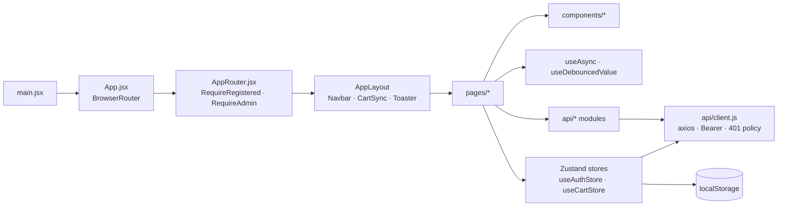
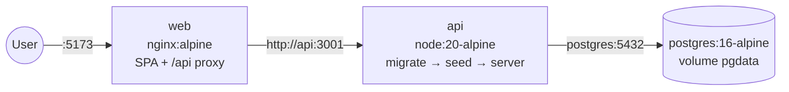

# Architecture

BookWorm is a dark-themed e-bookstore built as an npm-workspaces monorepo with three packages:

| Package | Role | Key tech |
|---|---|---|
| `packages/shared` (`bookworm-shared`) | Pricing, currency, dates and id helpers used by **both** API and web | Plain ESM, Vitest |
| `packages/api` (`bookworm-api`) | REST API, business rules, persistence | Express 5, Prisma 6, PostgreSQL 16, OpenAPI 3 + express-openapi-validator |
| `packages/web` (`bookworm-web`) | Single-page app | React 18, Vite 6, Tailwind 3, React Router 6, Zustand 5, Axios |

## System context

```mermaid
flowchart LR
  browser[Browser<br/>React SPA] -->|HTTPS /api/*| edge
  subgraph edge[Edge]
    vite[Vite dev server :5173<br/>— or —<br/>nginx :80 in Docker]
  end
  edge -->|/api proxy (Docker)<br/>direct in dev| api[Express API :3001]
  api -->|Prisma Client| db[(PostgreSQL 16)]
  api -->|setInterval| sweeper[Reservation sweeper]
  sweeper --> db
  dev[Developer] -->|Swagger UI /api/docs<br/>Insomnia collection| api
```

- **Development:** the SPA runs on Vite (`:5173`) and calls the API directly at `VITE_API_URL=http://localhost:3001/api` (CORS allows `CORS_ORIGIN`).
- **Docker:** nginx serves the built SPA and proxies `/api/` to the `api` container, so the browser sees a single origin (`VITE_API_URL=/api`). See [developer-guide.md](developer-guide.md#docker).

## API layering

```mermaid
flowchart TB
  req[HTTP request] --> mw1[helmet · cors · json · morgan]
  mw1 --> oav[express-openapi-validator<br/>request validation · uuid path ids]
  oav --> auth[authenticate / requireRole / requireRegistered]
  auth --> routes[*.routes.js]
  routes --> ctrl[*.controller.js<br/>HTTP in/out only]
  ctrl --> svc[*.service.js<br/>business rules · transactions]
  svc --> ser[*.serializer.js<br/>paise + INR, flags]
  svc --> prisma[src/lib/prisma.js<br/>single PrismaClient]
  svc --> shared[bookworm-shared<br/>computeOrderTotals …]
  ctrl -.errors.-> eh[errorHandler<br/>{ error: { code, message, details? } }]
```

- `src/app.js` exports `createApp(options)`; `server.js` only loads `.env`, starts the sweeper and listens. Tests import `createApp` and run against the `bookworm_test` database.
- **Spec-first:** `openapi/openapi.yaml` is the contract. Requests are always validated; responses are validated in tests (`enableResponseValidation`), so any drift fails the suite.
- **Modules** (`src/modules/*`): `auth`, `users` (addresses), `catalog` (categories, publishers, books, reviews, recommendations), `authors`, `cart`, `wishlist`, `coupons`, `orders` (checkout, cancel/return/refund, lookup), `payments` (mock gateway, wallet), `shipments` (rate, tracking, simulator), `admin`.
- **Background job:** `src/jobs/reservationSweeper.js` expires PENDING orders whose 30-minute stock reservation has lapsed and restores stock.

### Cross-cutting concerns

| Concern | Implementation |
|---|---|
| Authentication | JWT (HS256) in `Authorization: Bearer`. Roles `GUEST`, `CUSTOMER`, `ADMIN`. Guest tokens carry a `gsid` (guest-session id) and last 24 h |
| Authorization | `requireRole('ADMIN')`, `requireRegistered` (CUSTOMER/ADMIN). Guests may only touch orders/payments whose `guestSessionId === gsid` |
| Validation | OpenAPI schemas (types, patterns, `additionalProperties: false`) + service-level rules |
| Errors | `AppError(status, code, message, details)`; Prisma `P2002` → 409, `P2025` → 404; unknown errors → 500 without stack traces |
| Money | Integer paise everywhere; responses add formatted `xxxInr` via `formatINR` |
| Rate limiting | `POST /orders/lookup` limited per IP (`RATE_LIMIT_LOOKUP_MAX`/min); honours `TRUST_PROXY` behind nginx |
| Secrets & PII | Passwords hashed with bcrypt; card numbers/CVV never stored or logged (only `cardLast4`); request bodies are never logged |

## Web architecture



- **State:** `useAuthStore` (token + user, persisted) and `useCartStore` (two modes: `local` for anonymous visitors, `server` once any token exists). Everything else is page-local via `useAsync`.
- **API client:** injects the Bearer token, supports `skipAuth` (public lookups) and `optionalAuth` (retries without the token on 401 for public catalogue calls), and signs the user out on other 401s.
- **Pricing preview:** the cart uses the same `computeOrderTotals` as the server, so totals never disagree.

## Deployment topology (Docker Compose)



`api` waits for a healthy `postgres`; `web` waits for a healthy `api` (`/api/health`). The api entrypoint runs `prisma migrate deploy`, then the idempotent seed when `SEED_ON_START=true`, then `node server.js` as the non-root `node` user.
