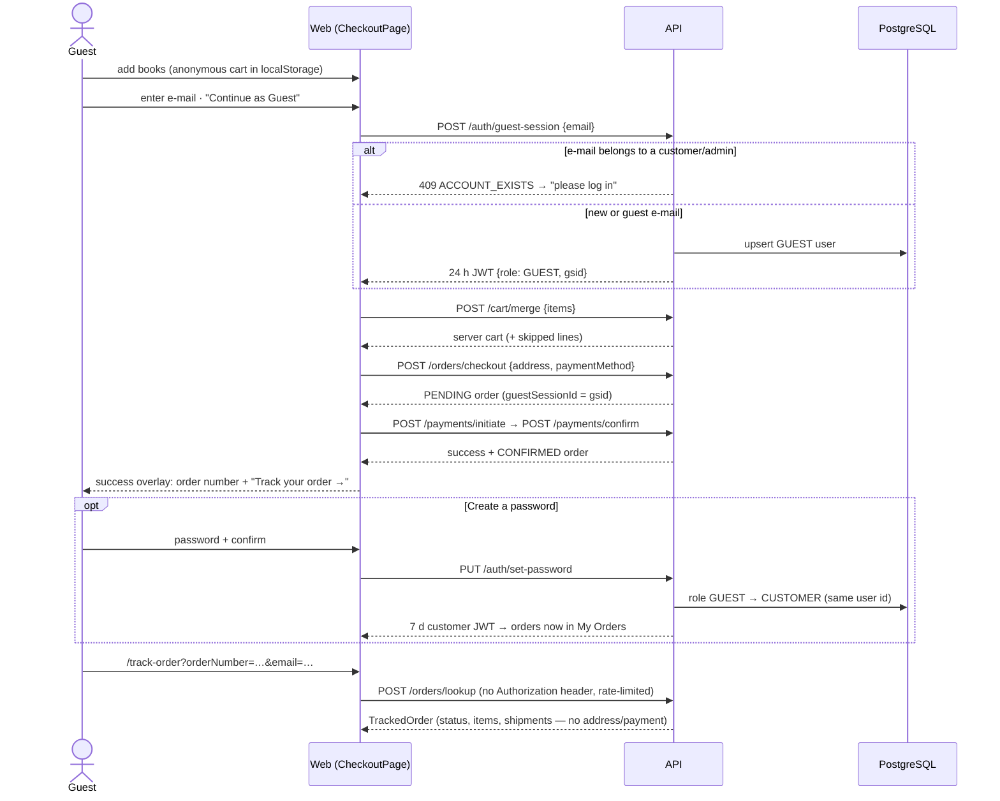
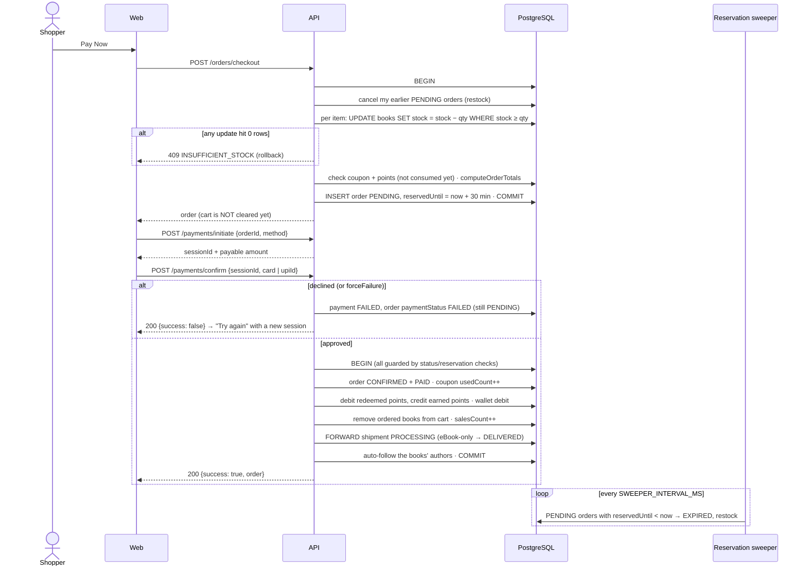
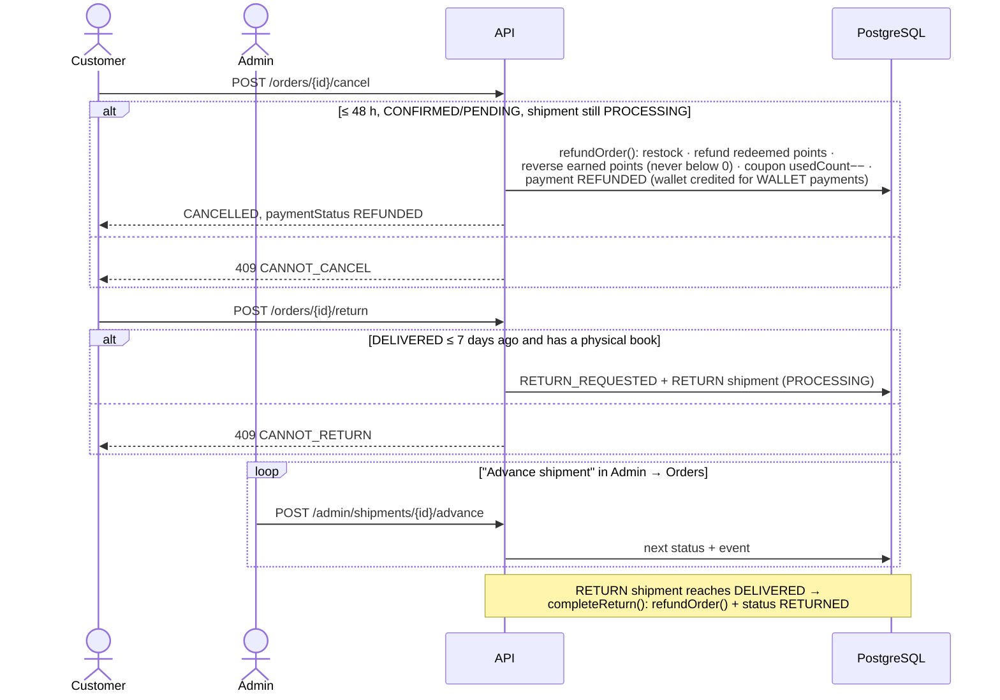
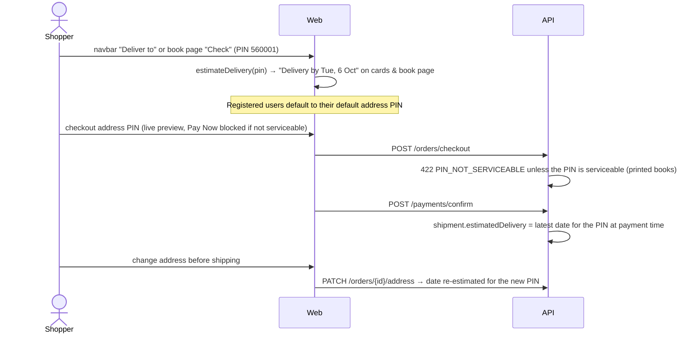
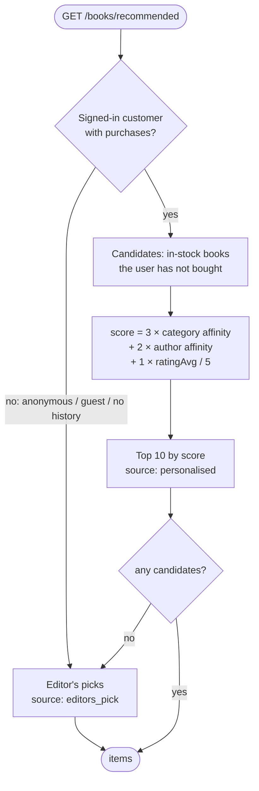

# Data flows

Sequence diagrams for the flows with the most moving parts. All money values are paise; totals always come from `computeOrderTotals` in `bookworm-shared`.

## 1. Guest checkout, tracking and account conversion

Guest rules: a guest token can only see orders and payments whose `guestSessionId` equals its `gsid`; guests cannot list orders, use the wallet, redeem points, review or follow.

## 2. Checkout, payment and the stock reservation

If a business rule fails inside the payment transaction (reservation lapsed, coupon limit reached, not enough points or wallet balance) the payment is recorded as FAILED with that reason instead of half-applying changes. Card numbers and CVV are used only for the mock decision; only `cardLast4` is stored.

## 3. Cancel, return and refund

The server computes `flags { canCancel, canReturn, canModifyAddress }` for every order; the web app only shows the buttons the flags allow, and the API re-checks on every request.

## 4. Delivery estimates (PIN zones)

Delivery dates depend on the destination PIN; no courier API is involved. The rules live in `bookworm-shared` (`estimateDelivery`), so the web preview and the server's committed date always agree.

| Destination (warehouse 560001, Bengaluru) | Rule | Business days |
|---|---|---|
| Same city | first 3 digits `560` | 1 |
| Same state | Karnataka circle `56`–`59` | 2 |
| Same region | first digit `5` | 3 |
| Metro | Delhi 110, Mumbai 400, Kolkata 700, Chennai 600, Hyderabad 500, Pune 411, Ahmedabad 380 | 3 |
| Rest of India | anything else | 4–5 (shown as a range) |
| Remote | North-East 78/79, J&K/Ladakh 18/19, Andaman 744, Lakshadweep 68255 | 6–8 (range) |
| Not serviceable | starts with 0 or 9 (APO), not 6 digits | refused |

- **Calendar:** IST, Monday–Friday, skipping national holidays (26 Jan, 15 Aug, 2 Oct, 25 Dec; add festival dates in `delivery.js`).
- **Cutoff:** orders paid before **2 PM IST** on a business day dispatch the same day; later ones dispatch the next business day. The UI shows "Order within 2 h 15 m to ship today".

Without a PIN, catalogue responses say "Usually delivered in 1–8 business days" — no firm date is promised until the PIN is known.

## 5. Recommendations

- **Category affinity** — the share of the user's purchased quantity that falls in the candidate's categories (0–1).
- **Author affinity** — 1 if the user follows the author or bought from them before.
- Bestsellers (`salesCount` desc) and New Launches (`publishedAt` desc) are separate, non-personalised shelves.
- **Discover Writers** (`/authors/suggestions`) — authors with books in categories the user bought from and does not follow yet; empty for users without purchases.
