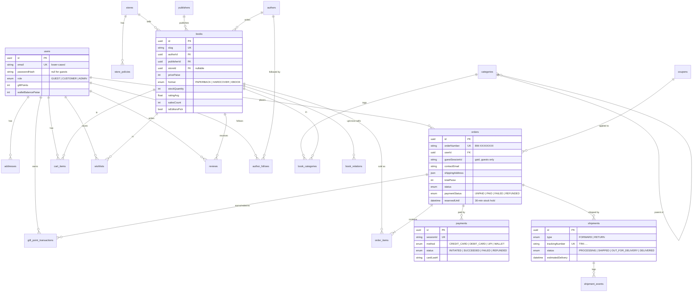
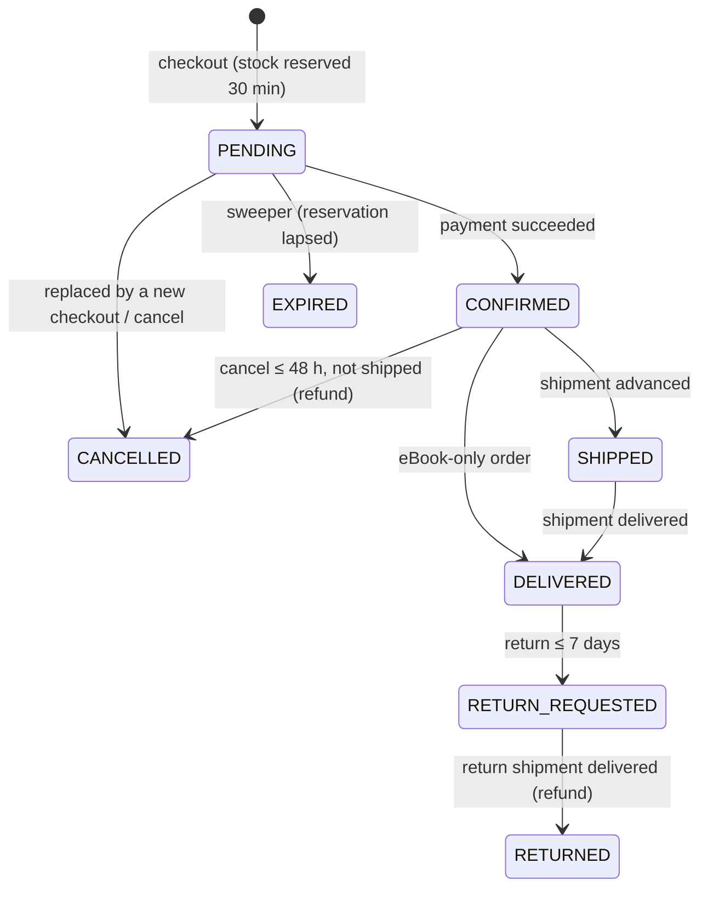

# Data model

PostgreSQL 16 via Prisma 6 (`packages/api/prisma/schema.prisma`). 21 tables, UUID primary keys (`@db.Uuid`), snake_case table/column names.

**Conventions**

- **Money is integer paise** (`pricePaise`, `totalPaise`, `walletBalancePaise` …). ₹149 = `14900`. The API adds a formatted `xxxInr` next to every `xxxPaise`.
- `orders.userId` is never null — a guest session creates a real `GUEST` user row; conversion keeps the same id.
- Orders snapshot what can change later: `shippingAddress` (JSON), `order_items.titleSnapshot` and `priceAtPurchasePaise`.
- Payment rows never contain card numbers or CVV — only `cardLast4` / `upiHandleMasked`.

## Entity–relationship diagram

## Tables

| Table | Purpose | Notable constraints |
|---|---|---|
| `users` | Accounts (guest, customer, admin), gift points, wallet | `email` unique |
| `addresses` | Saved delivery addresses | one `isDefault` per user (service-enforced) |
| `stores`, `store_policies` | Store profile + RETURN/CANCELLATION/SHIPPING/PAYMENT policies | `(storeId, type)` unique |
| `categories` | Two-level genre tree; `showInSidebar`, `displayOrder` | `slug` unique; depth ≤ 2 (service-enforced) |
| `book_categories` | Many-to-many books ↔ categories with exactly one `isPrimary` | PK `(bookId, categoryId)` |
| `publishers` | "Brands" for the sidebar filter | `slug` unique |
| `authors`, `author_follows` | Writers and who follows them (`MANUAL` / `AUTO_PURCHASE`) | `(userId, authorId)` unique |
| `books` | Catalogue | `slug` unique |
| `book_relations` | `UPSELL` / `CROSS_SELL` links | PK `(bookId, relatedBookId, type)` |
| `reviews` | 1–5 stars, comment ≤ 100 chars | `(bookId, userId)` unique (upsert) |
| `wishlists`, `cart_items` | Per-user lists | `(userId, bookId)` unique |
| `coupons` | `FLAT` (paise) or `PERCENT` (whole %) with min order, cap, expiry, usage limit | `code` unique |
| `orders`, `order_items` | Orders with price/total snapshots | `orderNumber` unique |
| `payments` | Mock gateway transactions | `sessionId` unique |
| `shipments`, `shipment_events` | Forward and return shipments + timeline | `trackingNumber` unique |
| `gift_point_transactions` | Point ledger (CREDIT/DEBIT with reason) | — |

## Status machines

Shipments move `PROCESSING → SHIPPED → OUT_FOR_DELIVERY → DELIVERED` (admin simulator: `POST /admin/shipments/:id/advance`).

## Migrations & seed

- Migrations: `packages/api/prisma/migrations/` — `npm run db:migrate` (dev), `prisma migrate deploy` (Docker/CI).
- Seed: `npm run db:seed` → `prisma/seed/index.js` (idempotent; fixed ids/slugs). Creates 24 categories, 4 publishers, 12 authors, 36 books, 3 users, 4 coupons, 2 historical orders, the main store and its 4 policies.
