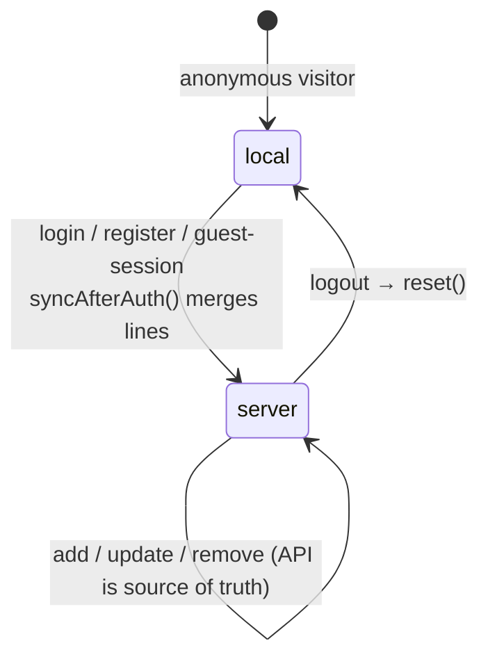

# Frontend components

`packages/web/src` — React 18 function components, Tailwind classes with `bw-*` theme tokens, PropTypes on every reusable component.

## Folder map

| Folder | Contents |
|---|---|
| `api/` | `client.js` (axios instance, `errorMessage`, `errorCode`), `auth.js`, `catalog.js`, `wishlist.js`, `orders.js`, `admin.js` |
| `stores/` | `useAuthStore` (persist key `bookworm-auth`), `useCartStore` (persist key `bookworm-cart`) |
| `hooks/` | `useAsync(load, deps)` → `{ data, loading, error, reload, setData }`; `useDebouncedValue(value, ms)` |
| `router/` | `AppRouter.jsx` (all routes), `guards.jsx` (`RequireRegistered`, `RequireAdmin`) |
| `layouts/` | `AppLayout` — Navbar, `CartSync`, toasts |
| `components/` | Reusable UI (below) |
| `pages/` | One component per route; page-only pieces live in `pages/<page>/` |
| `test/` | MSW server + default handlers, render helpers, fixtures |
| `utils/` | `format.js` (`formatDate`, `formatDateTime`, `formatLabel`), `redirect.js` (`safeRedirect`) |

## Reusable components

| Component | Props | Notes |
|---|---|---|
| `Navbar` | — | Links per role, cart badge (`data-testid="cart-badge"`), profile menu (Headless UI) |
| `BookCard` / `BookGrid` | `book`, `compact?` / `books`, `compact?` | Cover with hover/focus "Add to Cart", author + category links, delivery text. `bookShape` PropType |
| `AuthorCard` | `author`, `isFollowing?`, `onFollow?`, `onUnfollow?`, `busy?` | Button only rendered when a handler is given |
| `StarRating` | `value`, `onChange?`, `size?` | Read-only or radio-group input |
| `StatusBadge` | `status` | Order, payment, shipment and active/inactive statuses; `STATUS_LABELS` export |
| `ShipmentTimeline` | `shipment` | 4-step progress + event log; region label "Delivery tracking" / "Return tracking" |
| `OrderSummaryPanel` | `totals`, `title?`, `children?`, `footer?` | Grand Total panel (always 2 decimals via `formatINRFixed`) |
| `AddressForm` | `initialValue?`, `onSubmit`, `formId?`, `children?` | Exports `validateAddress`, `toAddressPayload`, `EMPTY_ADDRESS`; submit from outside via `form={formId}` |
| `ConfirmDialog` | `open`, `title`, `message?`, `confirmLabel?`, `cancelLabel?`, `destructive?`, `busy?`, `onConfirm`, `onClose` | Used for every destructive action |
| `EmptyState` | `title`, `message?`, `action?`, `icon?` | |
| `LoadingSpinner`, `SkeletonCard` / `SkeletonGrid` | `label?` / `count?`, `compact?` | Loading placeholders |
| `Breadcrumb` | `items` | |
| `Pagination` | `page`, `totalPages` | Writes `?page=` to the URL |
| `TextField` | `id`, `label`, `error?`, …input props | Labelled input with inline error |

## Pages

| Route | Page | Highlights |
|---|---|---|
| `/` | `HomePage` | Genre sidebar, filter bar and chips (all state in the URL); Recommended / Bestsellers / New Launches or a paginated result grid |
| `/books/:bookId` | `BookDetailPage` | Covers, wishlist, follow author, reviews form, related / cross-sell / up-sell shelves |
| `/authors/:authorId` | `AuthorPage` | Profile, follow toggle, books |
| `/checkout` (`/cart`) | `CheckoutPage` | Cart lines, guest gate, saved/typed address, coupon, gift points, `PaymentModal`, `PaymentSuccessOverlay` |
| `/orders`, `/orders/:orderId` | `OrdersPage`, `OrderDetailPage` | Buy Again; Cancel / Return / Change address driven by server `flags` (`pages/orders/OrderActions.jsx`) |
| `/wishlist` | `WishlistPage` | Cards with remove + add to cart |
| `/writers` | `MyWritersPage` | Your Writers, New from Your Writers, Discover Writers — each loads independently, optimistic follow/unfollow |
| `/track-order` | `TrackOrderPage` | Public lookup; prefilled from `?orderNumber=&email=` (auto-submits); 404 and 429 messages |
| `/login`, `/register` | `LoginPage`, `RegisterPage` | Safe `?redirect=` handling, cart merge after sign-in |
| `/admin/*` | `admin/AdminPage` | Books (list + `AdminBookForm`), categories, publishers, authors, coupons, store & policies, orders with "Advance shipment" |
| `*` | `NotFoundPage` | |

Registered-only routes use `RequireRegistered` (guests and anonymous visitors → `/login?redirect=…`); `/admin/*` uses `RequireAdmin` (customers → `/`).

### Checkout pieces (`pages/checkout/`)

- `GuestGate` — email form → `POST /auth/guest-session`; registered emails are told to log in.
- `CartItems`, `CouponField` — quantity steppers, remove with confirmation, coupon validation.
- `PaymentModal` — Credit/Debit card (formatted `XXXX-XXXX-XXXX-XXXX`, `MM/YYYY`), UPI, Wallet (hidden for guests, insufficient-balance state), DEV-only "Simulate failure", retry and reservation-expired handling. The CVV is cleared after every attempt and nothing card-related is persisted.
- `PaymentSuccessOverlay` — purchased books; for guests the order number, a "Track your order →" link and a "Create a password" conversion form.

### Admin pieces (`pages/admin/`)

- `CrudSection` — generic table + create/edit dialog + delete confirmation driven by `columns` and `fields` configs. Used for categories, publishers, authors, coupons, stores and policies.
- `FormField` + `forms.js` — field renderer and helpers (`slugify`, `rupeesToPaise`, `validateFields`, `compact`, date helpers).
- `AdminBookForm` — full book editor with category multi-select + primary radio and up-sell/cross-sell pickers. Exports `validateBook` and `toBookPayload`.

## State

- **Auth store:** `{ token, user }` with selectors `selectIsRegistered`, `selectIsGuest`, `selectIsAdmin`.
- **Cart store:** `items: [{ book, quantity }]`; `cartTotals(items, opts)` previews totals with the shared `computeOrderTotals`. Only the anonymous cart is persisted.

## Testing

Vitest + Testing Library + MSW (`src/test/server.js`). Unhandled requests fail the test, so each test declares the API it relies on.

- `renderApp(path)` renders the whole router; `renderAt(element, { path, route })` renders one element; both include a `LocationProbe` (`data-testid="location"`).
- `signIn('customer' | 'guest' | 'admin')`, `signOut()` set the auth store without network calls.
- Fixtures: `joy`, `path`, `vanishing`, `joyDetail`, `cartResponse()`, `orderFixture()`, `shipment()`.
- Toasts: `vi.mock('react-hot-toast', () => import('../test/toastMock.js'))`.
